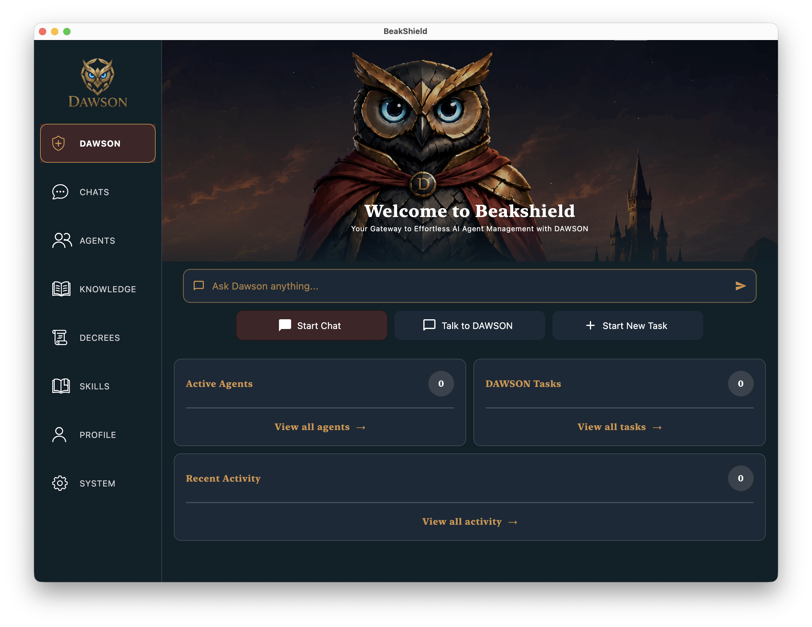
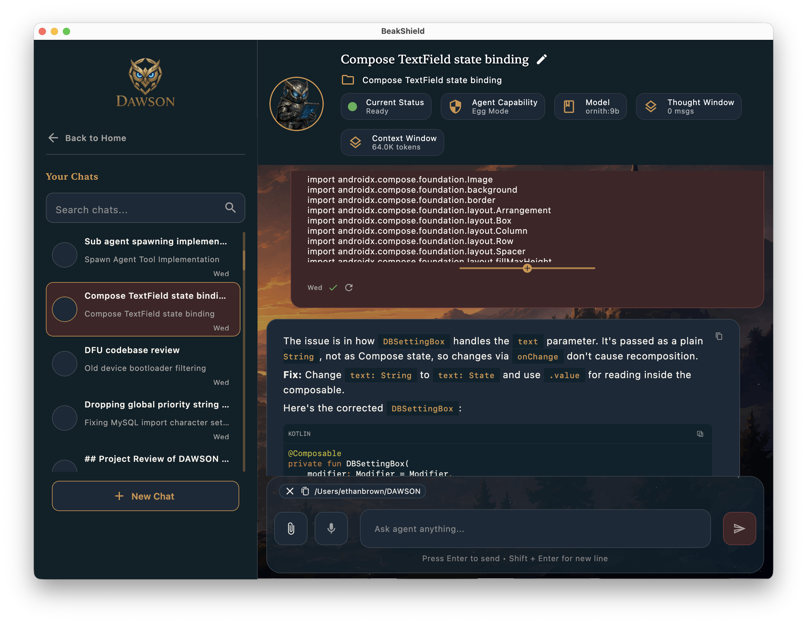
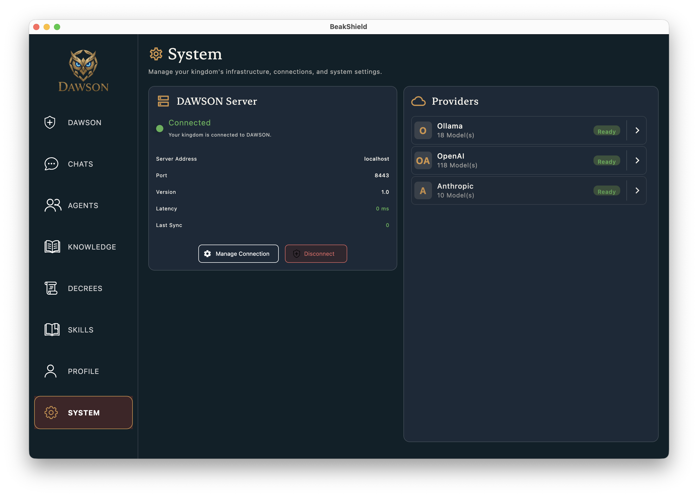

  

# Beakshield

### Secure companion application for the DAWSON AI ecosystem.

*A cross-platform companion application for managing AI agents, conversations, permissions, providers, and the growing knowledge of your personal AI kingdom.*

---

## What is Beakshield?

Beakshield is the primary interface for interacting with **DAWSON** (https://github.com/OBrown101/dawson-server).

Rather than exposing users to terminals, configuration files, and server commands, Beakshield provides a clean, intuitive interface for managing every aspect of a DAWSON installation.

Whether you're chatting with AI agents, configuring local or frontier models, reviewing security permissions, or eventually managing your kingdom's shared knowledge, Beakshield is intended to be the single place where everything comes together.

---

  

---

# Why Beakshield?

DAWSON intentionally focuses on being a capable, portable AI server.

Beakshield focuses on making that power approachable.

The goal is not simply to build another AI chat application, but to provide a complete control center for your personal AI ecosystem.

As DAWSON grows beyond individual chats into persistent agents, long-running tasks, and shared knowledge, Beakshield grows alongside it by providing intuitive ways to observe, configure, and manage the entire system.

---

# Design Goals

Rather than listing features, this section describes the ideas driving Beakshield.

Each item is marked with its current implementation status.

---

## 💬 Agent Conversations *[Working]*

Every conversation takes place with its own dedicated **Squirebot**.

Chats maintain their own context while benefiting from DAWSON's shared knowledge, allowing every conversation to remain focused without becoming isolated.

---

## 🛡 Security Made Visible *[Working]*

AI systems should never leave users wondering what they are allowed to access.

Beakshield exposes DAWSON's permission system through an intuitive interface.

Directory workspaces, permission modes, and security settings can all be configured without editing configuration files.

---

  

---

## 🤖 Model Management *[Working]*

Switch between local and frontier models with ease.

Beakshield provides a unified interface for configuring providers including:

- Ollama
- OpenAI
- Anthropic

---

## 🖥 System Configuration *[Working]*

Most DAWSON configuration can be performed directly through Beakshield.

Rather than manually editing server settings, users can manage providers, server behavior, networking, and future system capabilities through a dedicated interface.

---

  

---

## 📚 Kingdom Knowledge *[Planned]*

Knowledge should not disappear into a black box.

Beakshield is planned to provide complete visibility into DAWSON's shared MemPalace knowledge.

Users will be able to browse, search, inspect, edit, and remove memories while understanding exactly why they exist.

---

## 👑 Kingdom Management *[Planned]*

As DAWSON evolves into a persistent orchestrator, Beakshield will become the administrative center of the kingdom.

Planned management features include:

- DAWSON dashboard
- Agent hierarchy visualization
- Live activity monitoring
- Background task management
- User profiles
- Royal Decree management
- Claude Skills library

---

## 📈 Visibility & Control *[Planned]*

As DAWSON grows beyond individual conversations, users need clear visibility into what their AI ecosystem is doing.

Beakshield is designed to become the central place for monitoring agents, reviewing permissions, inspecting shared knowledge, and managing long-running workflows.

Rather than scattering configuration across prompts and files, the goal is to provide a single interface where the entire kingdom can be observed and managed.

---

# Current Focus

Current development is focused on creating a polished desktop experience while DAWSON's underlying orchestration platform continues to mature.

The objective is to provide an interface that feels approachable for everyday users while remaining powerful enough for engineers who want fine-grained control over their AI environment.

---

# Current Project Status

## ✅ Working

- Secure DAWSON connectivity
- Multi-chat interface
- Dedicated Squirebot conversations
- Provider management
- OpenAI support
- Anthropic support
- Ollama support
- Permission mode configuration
- Directory workspace management
- Cross-platform desktop foundation

---

## 🚧 In Progress

- User interface refinement
- Additional chat configuration

---

## 📅 Planned

- DAWSON dashboard
- Knowledge browser
- Royal Decree management
- Skills library
- User profiles
- Live agent monitoring
- Agent hierarchy visualization
- Background task management
- Voice interaction
- Expanded workflow management

---

# Philosophy

Beakshield aims to make DAWSON approachable without hiding how it works.

The long-term vision is a companion application that gives users complete visibility into their AI ecosystem while remaining clean, intuitive, and enjoyable to use.

Just as importantly, Beakshield is intended to remain approachable for engineers and developers who want to contribute, extend, and experiment with the platform. Built with Kotlin Multiplatform, it enables new features and improvements to be shared across supported platforms with minimal platform-specific effort.

Whether you're simply chatting with an AI assistant or managing an entire kingdom of collaborating agents, Beakshield is intended to be the place where it all comes together.
